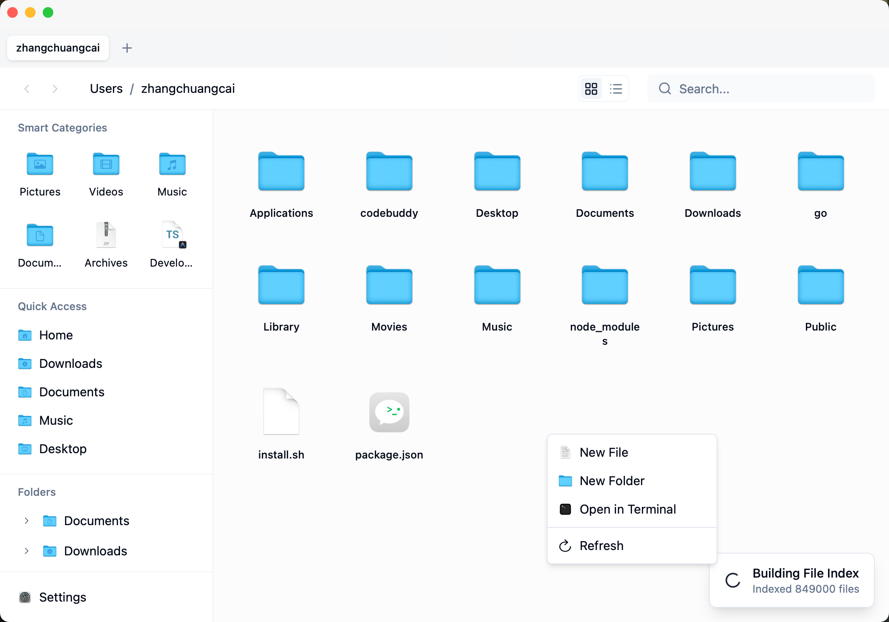

# HyperExplorer

A modern, fast file manager for macOS — built with Rust and React.

[English](./README.md) | [中文](./README.zh-CN.md)

HyperExplorer brings the best of Windows Explorer to macOS: an editable address bar, a persistent folder tree, and blazing-fast Everything-style search — all wrapped in a native macOS design.



## Features

- **Editable Address Bar** — Navigate by typing paths, copy/paste, breadcrumb clicking
- **Folder Tree Sidebar** — Windows-style collapsible tree with lazy loading
- **Everything-Style Search** — Millisecond-level full-disk search powered by SQLite FTS5 + Rust
- **Smart Categories** — Quick filters for images, videos, documents, audio, archives, and code files
- **Multi-Tab & Multi-Window** — Drag tabs between windows, per-tab navigation history
- **Cmd+X Cut** — Native cut support, no more Cmd+C → Cmd+Option+V
- **QuickLook Preview** — Press Space to preview files (text, images, video, audio, PDF)
- **Context Menus** — Windows-style right-click with 20+ actions: "New File", "Open in Terminal", "Copy Path", etc.
- **Dark Mode** — Light / Dark / System theme
- **i18n** — English and Simplified Chinese

## Tech Stack

| Layer | Technology |
|-------|-----------|
| Desktop Framework | [Tauri 2](https://tauri.app/) |
| Frontend | React 19 + TypeScript 5.8 |
| Backend | Rust (2021 edition) |
| Styling | Tailwind CSS 4 + shadcn/ui |
| Search Engine | SQLite FTS5 + parallel filesystem traversal |
| Build Tool | Vite 7 |
| Package Manager | pnpm |

## Build from Source

**Prerequisites:**
- [Node.js](https://nodejs.org/) (LTS)
- [pnpm](https://pnpm.io/)
- [Rust](https://www.rust-lang.org/tools/install)
- Xcode Command Line Tools (`xcode-select --install`)

```bash
# Clone the repository
git clone git@github.com:callback-io/hyperExplorer.git
cd hyperExplorer

# Install dependencies
pnpm install

# Run in development mode
pnpm tauri dev

# Build production app (.dmg)
pnpm tauri build
```

## Development

### Commands

| Command | Description |
|---------|-------------|
| `pnpm tauri dev` | Start app with hot reload |
| `pnpm tauri build` | Build production app bundle |
| `pnpm dev` | Frontend dev server only (port 1420) |
| `pnpm check` | ESLint + TypeScript check |
| `pnpm cargo:clippy` | Rust lint (warnings = errors) |
| `pnpm check:all` | All checks (frontend + Rust) |

### Project Structure

```
src/                    # React frontend
├── components/         # UI components (FileList, Sidebar, TabBar, TopBar, etc.)
├── hooks/              # Custom hooks (useTabs, useSetting, useTheme)
├── stores/             # Zustand stores (viewMode, clipboard)
├── contexts/           # React contexts (tabs, theme)
├── lib/                # Utilities (i18n, settings, window manager)
└── locales/            # i18n translations (en, zh)

src-tauri/src/          # Rust backend
├── commands/           # Tauri commands (fs, search, apps, watcher)
├── db/                 # SQLite layer (schema, indexer, search engine)
└── index/              # In-memory index (fallback)
```

### Git Hooks

Pre-commit hooks via [Husky](https://typicode.github.io/husky/) + [lint-staged](https://github.com/lint-staged/lint-staged):
- `*.{ts,tsx}` → ESLint fix + Prettier
- `*.{json,css,md}` → Prettier

## License

[BSL 1.1](./LICENSE) — Free for non-commercial use. See LICENSE for details.
